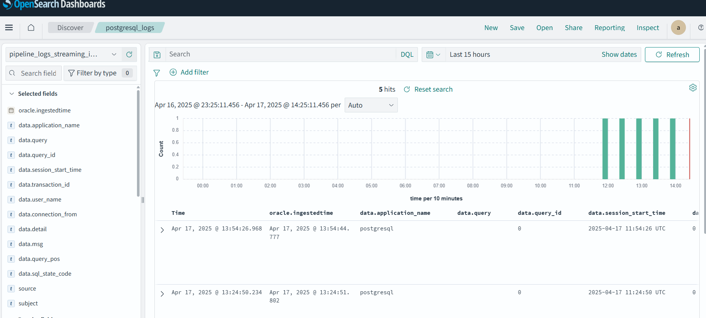
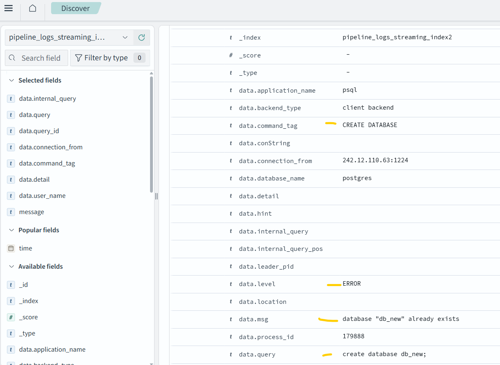
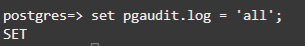
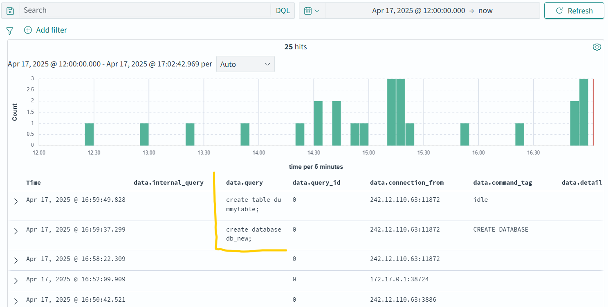

# Ingest OCI PostgreSQL logs into OCI OpenSearch for database monitoring

The following steps will use OCI Logging and OCI Streaming to stream pg_audit logs coming from OCI PostgreSQL into OCI OpenSearch, using pipelines.
The below steps follow the following flow: OCI PostgreSQL logs (pg_audit) > OCI Logging > Connector Hub > OCI Streaming > OCI OpenSearch Pipelines > OCI OpenSearch

## 1. Create an OCI postgreSQL database and OCI OpenSearch cluster
- Set up default VCN with private and public subnet, open ports for OCI OpenSearch and OCI PostgreSQL
- Create an OCI OpenSearch cluster an OCI PostgreSQL instance

## 2. Create logging for OCI PostgreSQL
- Create an OCI Log Group
- Follow the steps here to enable OCI Logging for OCI PostgreSQL. [link to documentation](https://docs.oracle.com/en-us/iaas/Content/postgresql/logging-service-logs.htm#logging)
- Use the below as example for CLI to enable logging.

  ```
  oci logging log create --display-name "postgres_logging" --log-group-id [YOUR_LOG_GROUP_OCID] --log-type SERVICE --is-enabled true --configuration '{"compartmentId":"[YOUR_COMPARTMENT_OCID]","source":{"resource":"[YOUR_OCI_POSTGRESQL_INSTANCE_OCID","service":"postgresql","sourceType":"OCISERVICE","category":"postgresql_database_logs"}}'
  ```

## 3. Create an OCI Stream and Connector Hub
- Go to OCI Streaming and create a Stream
- Go to Connector Hub and select OCI Logging as source, with your Log group and specific Log name to which the OCI PostgreSQL logs are pushed
- Select your just created Stream as target. After creating the connector, go to your Stream. When logs are sent in the last minute, you can see a message like the below.

  ```
  {'data': {'application_name': 'postgresql',
    'backend_type': 'postmaster',
    'command_tag': '',
    'conString': '',
    'connection_from': '',
    'database_name': '',
    'detail': '',
    'hint': '',
    'internal_query': '',
    'internal_query_pos': '',
    'leader_pid': '',
    'level': 'LOG',
    'location': '',
    'msg': 'received fast shutdown request',
    'process_id': '18',
    'query': '',
    'query_id': '0',
    'query_pos': '',
    'session_id': '67fe430e.12',
    'session_line_num': '11',
    'session_start_time': '2025-04-15 11:29:18 UTC',
    'sql_state_code': '00000',
    'transaction_id': '0',
    'user_name': '',
    'virtual_transaction_id': ''},
   'id': 'e7f25bcf-5fa9-4c73-9a71-',
   'oracle': {'compartmentid': 'ocid1.compartment.oc1..',
    'ingestedtime': '2025-04-15T11:58:29.386Z',
    'loggroupid': 'ocid1.loggroup.oc1.eu-frankfurt-1.',
    'logid': 'ocid1.log.oc1.eu-frankfurt-1.',
    'tenantid': 'ocid1.tenancy.oc1..'},
   'source': 'ocid1.postgresqldbsystem.oc1.eu-frankfurt-1.',
   'specversion': '1.0',
   'subject': '146ec356-89ed-4084-baba-',
   'time': '2025-04-15T11:58:25.354Z',
   'type': 'com.oraclecloud.postgresql.postgresqlDbSystem.postgresql_database_logs'}
   ```

## 4. In OCI OpenSearch, create a Pipeline
- First, in OCI Vault, create a secret for your OCI OpenSearch username and password
- Go to OCI OpenSearch, click on Pipeline. Use the below YAML and change:
  - Your Vault Secret OCIDS for username and password
  - Your OCI Streaming bootstrap server
  - Your topic name and group_id
  - Your stream pool id (OCID)
  - Your OCI OpenSearch cluster OCID


  ```
  version: 2
  pipeline_configurations:
    oci:
      secrets:
        opensearch-username:
          secret_id: "ocid1.vaultsecret.oc1.iad.amaaaaaaeicj2tiakvgrvpgni25otepemketb5whptuiigh65d6ehc5rnzda" 
        opensearch-password:
          secret_id: "ocid1.vaultsecret.oc1.iad.amaaaaaaeicj2tiawkcd46idkvgpemzes5p4rmiuivlx53xlcn4y4p6fapfq"
  kafka-pipeline2:
    source:
      kafka:
        bootstrap_servers:
          - "https://cell-1.streaming.eu-frankfurt-1.oci.oraclecloud.com:9092"
        topics:
          - name: "postgres_logs"
            group_id: "DefaultPool"
        acknowledgments: true
        encryption:
          type: ssl
          insecure: false
        authentication:
          sasl:
            oci:
              stream_pool_id: "ocid1.streampool.oc1.eu-frankfurt-1.amaaaaaaeicj2tiarw4bnzt7he7ask4ioqfc74cbxwrsaxgpj2mxpri5chyq"
    processor:
      - parse_json:
  
    sink:
      - opensearch:
          hosts: ["ocid1.opensearchcluster.oc1.eu-frankfurt-1.amaaaaaaeicj2tia744ey3m53jfvzmc3heetuytnsb4fxgcz6ikyhgsmjpza"]
          username: ${{oci_secrets:opensearch-username}}
          password: ${{oci_secrets:opensearch-password}}
          insecure: false
          index: "pipeline_logs_streaming_index2"
  ```

## 5. Open OCI OpenSearch dashboard

- In OCI OpenSearch dashboard, create a new Index Patterns. Use the Index name you provided in the pipeline YAML. In the above example, that is "pipeline_logs_streaming_index".
- In OCI OpenSearch dashboard, go to Discover. Review the incoming logs by adding several variables to the report. Make sure the time range is in order. See example in the below image.




## 6. Test logging by executing SQL statements
- Log in to your OCI PostgreSQL instance
- Execute an example statement, like below. 

  ```
  CREATE TABLE products ( 

    product_no integer, 

    name text, 

    price numeric 

  ); 
  ```
  ```
  INSERT INTO products (product_no, name, price) VALUES 

  (1, 'Cheese', 9.99), 
  
  (2, 'Bread', 1.99), 
  
  (3, 'Meat', 1.55), 
  
  (4, 'Milk', 2.99), 
  
  (5, 'Bread', 1.99), 
  
  (6, 'Meat', 1.01), 
  
  (8, 'Meat', 3.99), 
  
  (9, 'Meat', 4.69), 
  
  (10, 'Meat', 1.99), 
  
  (11, 'Meat', 1.99), 
  
  (12, 'Milk', 2.99);
  ```

  ```
  create database db_new;
  ```
  
## 7. Review the logs in OCI OpenSearch
In Discover, open your log and select several fields that are available. An example is show below, in which a SQL statement "create database [db_name]" has been executed and returned an error because the database already exists. 



## 8. Review your pg_audit settings
[pg_audit](https://github.com/pgaudit/pgaudit/blob/main/README.md) is used to track activities and generate logs. You can change the settings of what is tracked (and logged) usin pg_audit.

- An example, changing the log settings.
  
  
  
  


