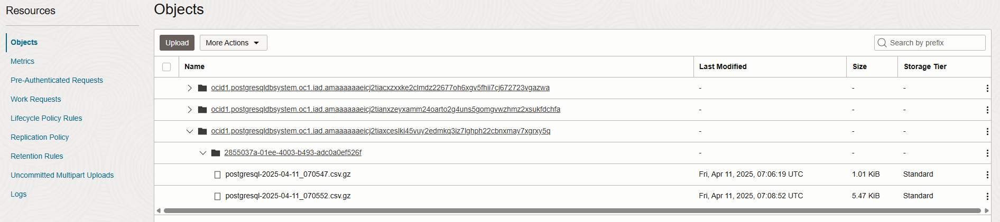
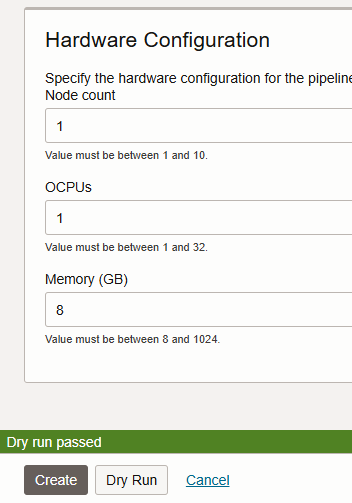

# Ingest OCI PostgreSQL logs into OCI OpenSearch for database monitoring

## 1. Enable logging
Enable export of logging from OCI PostgreSQL in Object Storage. See [documentation](https://docs.oracle.com/en-us/iaas/Content/postgresql/export-logs-to-object-storage.htm).

## 2. Create OCI ostgreSQL database and OCI OpenSearch cluster
- Set up default VCN with private and public subnet, add ports for OCI OpenSearch and OCI PostgreSQL
- Create OCI OpenSearch cluster in public subnet
- Create OCI PostgreSQL database, add a custom configuration with (See [documentation](https://docs.oracle.com/en-us/iaas/Content/postgresql/export-logs-to-object-storage.htm)).
  - oci.log_destination: oci_object_storage
  - oci.log_destination_os_namespace: The Object Storage namespace for the tenancy
  - oci.log_destination_os_bucket_name: The Object Storage bucket name to which the logs are exported

  When the OCI PostgreSQL instance is active, you should see already logs added to your bucket for your specific OCI PostgreSQL instance OCID.
  

  Logs in the bucket are extracted from OCI PostgreSQL and updated every 1 minute.

## 3. Test the logging output
- Log in to your OCI PostgreSQL instance
- Execute an example statement.

  ```
  CREATE TABLE products ( 

    product_no integer, 

    name text, 

    price numeric 

  ); 
  ```
  ```
  INSERT INTO products (product_no, name, price) VALUES 

  (1, 'Cheese', 9.99), 
  
  (2, 'Bread', 1.99), 
  
  (3, 'Meat', 1.55), 
  
  (4, 'Milk', 2.99), 
  
  (5, 'Bread', 1.99), 
  
  (6, 'Meat', 1.01), 
  
  (8, 'Meat', 3.99), 
  
  (9, 'Meat', 4.69), 
  
  (10, 'Meat', 1.99), 
  
  (11, 'Meat', 1.99), 
  
  (12, 'Milk', 2.99);
  ```
- Export the latest updated log file from the bucket, unzip, and review the csv file.

## 4. Set up Ingestion Pipeline

- Open your OCI OpenSearch cluster and create a new pipeline. Give it a name. Add the below YAML. Change the:
  - Region
  - Bucket names
  - Namespace
  - Your OCI PostgreSQL OCID and ID (under the prefix, in the filter)
  - Your Vault OCIDs for your username and password for OCI OpenSearch

 - **Source Coordination YAML**
```
source_coordination:
  store:
    oci-object-bucket:
      name: "oci_opensearch_pipeline_source_coordination"
      namespace: "fro8fl9kuqli"
```

- **Pipeline YAML**
```
version: 2
pipeline_configurations:
  oci:
    secrets:
      opensearch-username:
        secret_id: "ocid1.vaultsecret.oc1.iad."
      opensearch-password:
        secret_id: "ocid1.vaultsecret.oc1.iad."


postgresql-logs-pipeline:
  source:
    oci-object:
      acknowledgments: true
      codec:
        csv: null
      compression: gzip
      scan:
        scheduling:
          interval: PT60S
        buckets:
          - bucket:
              namespace: "fro8fl9kuqli"
              name: "oci_postgresql_logs_bp"
              region: "us-ashburn-1"
              filter:
                 include_prefix: ["ocid1.postgresqldbsystem.oc1.iad.amaaaaaaeicj2tiaxceslki45vuy2edmkq3iz7lghph22cbnxmay7xgrxy5q/2855037a-01ee-4003-b493-adc0a0ef526f"]

  sink:
    - opensearch:
        hosts: ["ocid1.opensearchcluster.oc1.iad.amaaaaaaeicj2tiaxwl72s22qzk7jm7ro6fpz2qmrc7xis2v6knzhejjmewa"]
        username: ${{oci_secrets:opensearch-username}}
        password: ${{oci_secrets:opensearch-password}}
        insecure: false
        index: "postgresql_logs_v1"
 
```
- When done, click on "Dry run" to test the YAML files.
  


test with unzipped csv.
```
version: 2
pipeline_configurations:
  oci:
    secrets:
      opensearch-username:
        secret_id: "ocid1.vaultsecret.oc1.iad."
      opensearch-password:
        secret_id: "ocid1.vaultsecret.oc1.iad."


postgresql-logs-pipeline:
  source:
    oci-object:
      acknowledgments: true
      codec:
        csv: null
      compression: "none"
      scan:
        scheduling:
          interval: PT60S
        buckets:
          - bucket:
              namespace: "fro8fl9kuqli"
              name: "oci_postgresql_logs_bp"
              region: "us-ashburn-1"

  sink:
    - opensearch:
        hosts: ["ocid1.opensearchcluster.oc1.iad.amaaaaaaeicj2tiaxwl72s22qzk7jm7ro6fpz2qmrc7xis2v6knzhejjmewa"]
        username: ${{oci_secrets:opensearch-username}}
        password: ${{oci_secrets:opensearch-password}}
        insecure: false
        index: "postgresql_logs_v1" 
```

